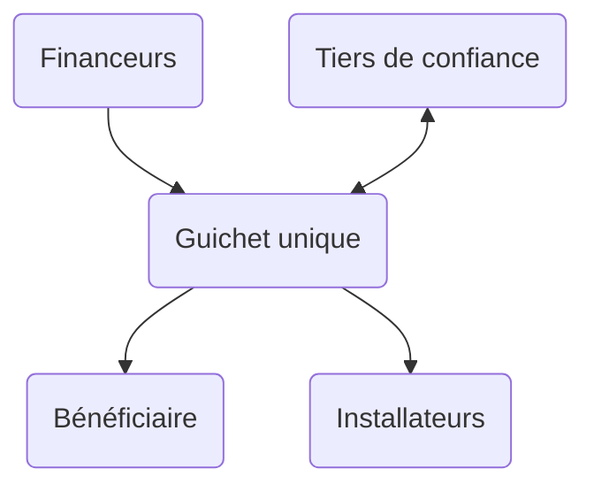
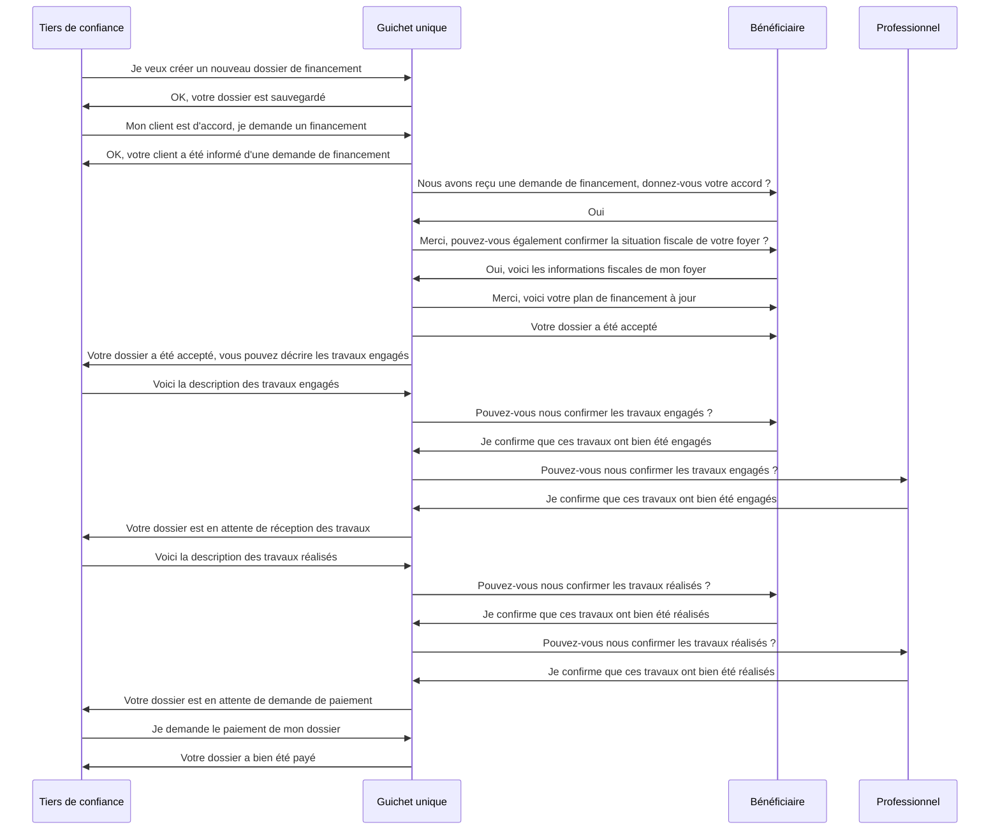
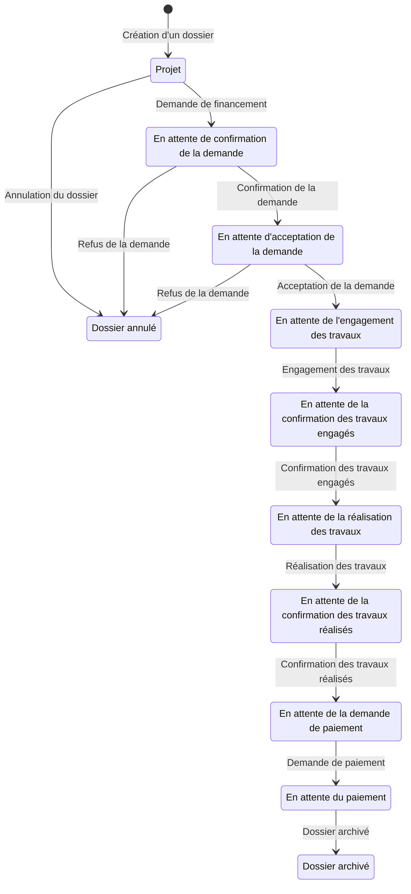

# @renolab/financement

Ce projet a pour objectif de proposer un parcours unique de financement des travaux de rénovation énergétique accompagnés par un tiers de confiance agréé (Mon Accompagnateur Rénov' / Référent d'Aide à la Rénovation).

## Synthèse

### Objectifs

🎯 Évaluer des aides financières pour des projets de rénovation énergétique  
🎯 Administrer une demande de financement en garantissant la cohérence et la sécurité des dossiers  
🎯 Proposer un modèle de guichet unique du financement de la rénovation énergétique  

### Usages

👉 Simulation d'un plan de financement pour des travaux de rénovation énergétique  
👉 Instruction numérique sécurisée d'une demande de financement (CEE/MPR)  
👉 Gestion des encours de financement CEE/MPR  

### Parties prenantes

🏛️ Agence Nationale de l'Habitat  
🏛️ Obligés et délégataires au titre du dispositif des Certificats d'Economies d'Energie  
🏛️ Accompagnateurs de la rénovation énergétique  

### Budget

**⚠️ Ce projet n'est pas financé pour le moment et est porté bénévolement**

### Contact

[Adrien Rosi Dit Rozzi](https://www.linkedin.com/in/adrienrosi/)

## Feuille de route

1. Conception du modèle d'évaluation des financements de la rénovation énergétique
2. Élaboration d'un parcours unique d'instruction des demandes
3. Design des APIs
4. Développement et déploiement des APIs

### 1. Conception du modèle d'évaluation des financements de la rénovation énergétique

**🛠️ Travaux en cours**

1. Définition du périmètre des travaux
2. Définition du périmètres des aides financières
3. Conception des règles métiers sur la base du modèle Publicodes

#### Sources

**MaPrimeRénov'**

- [Arrêté du 14 janvier 2020 relatif à la prime de transition énergétique](https://www.legifrance.gouv.fr/loda/id/JORFTEXT000041400376)
- [Arrêté du 24 mai 2013 relatif aux plafonds de ressources applicables à certains bénéficiaires des subventions de l'Agence nationale de l'habitat](https://www.legifrance.gouv.fr/loda/id/JORFTEXT000027481142/)
- [Arrêté du 17 novembre 2020 relatif aux caractéristiques techniques et modalités de réalisation des travaux et prestations dont les dépenses sont éligibles à la prime de transition énergétique](https://www.legifrance.gouv.fr/jorf/id/JORFTEXT000042532442)
- [Décret n° 2020-26 du 14 janvier 2020 relatif à la prime de transition énergétique](https://www.legifrance.gouv.fr/loda/id/JORFTEXT000041400291)
- [Site internet de l'Agence nationale de l'habitat](https://www.anah.fr/proprietaires/proprietaires-occupants/les-conditions-de-ressources/)
- [Site internet de l'ANAH](https://www.anah.fr/proprietaires/proprietaires-occupants/etre-mieux-chauffe-avec-maprimerenov/)

**Certificats d'Economies d'Energie**

- [Arrêté du 29 décembre 2014 relatif aux modalités d'application du dispositif des certificats d'économies d'énergie](https://www.legifrance.gouv.fr/loda/id/JORFTEXT000030001603/)
- [Arrêté du 22 décembre 2014 définissant les opérations standardisées d'économies d'énergie](https://www.legifrance.gouv.fr/loda/id/JORFTEXT000029953752/)

**Eco-prêt à taux zéro**

- [Code de la construction et de l'habitation : Chapitre IX : Avance remboursable sans intérêt destinée au financement de travaux de rénovation afin d'améliorer la performance énergétique des logements anciens](https://www.legifrance.gouv.fr/codes/section_lc/LEGITEXT000006074096/LEGISCTA000020460912)
- [Arrêté du 30 mars 2009 relatif aux conditions d'application de dispositions concernant les avances remboursables sans intérêt destinées au financement de travaux de rénovation afin d'améliorer la performance énergétique des logements anciens](https://www.legifrance.gouv.fr/loda/id/JORFTEXT000020459597/)

### 2. Élaboration d'un parcours unique d'instruction des demandes

**🛠️ Travaux en cours**

1. Définition des règles de cohérence
2. Conception des workflows étape par étape
3. Analyse des limites réglementaires

#### 1. Définition des règles de cohérence

Un parcours d'instruction des demandes d'aide financière doit implémenter les règles de cohérence suivantes :

- Identification et authentification du bénéficiaire
- Identification et authentification du professionnel ayant assuré la réalisation des travaux
- Éligibilité du bénéficiaire, y compris au regard de sa situation fiscale
- Éligibilité du professionnel ayant assuré la réalisation des travaux
- Éligibilité des travaux envisagés
- Conformité des travaux réalisés

#### 2. Conception des workflows étape par étape

**Les intervenants**

- Un **tiers de confiance** agréé (un Accompagnateur Rénov' par exemple)
- Le **bénéficiaire** du financement
- Le **professionnel** ayant assuré la réalisation des travaux
- Le **financeur**

**Les étapes clés**

1. Simulation de financement sur la base d'un avant-projet par le **tiers de confiance** et le **bénéficiaire**
    - Le bénéficiaire dispose d'un plan de financement prévisionnel
2. Demande de financement par le **tiers de confiance**
    - Les demandes de financement sont centralisées afin de faciliter le contrôle des flux
    - Un contrôle de cohérence sur l'éligibilité des travaux peut être réalisé
3. Confirmation de la demande de financement par le **bénéficiaire**
    - Le bénéficiaire est identifié et authentifié
    - Le bénéficiaire est vérifié comme étant à l'origine de la demande de financement
    - La situation fiscale du bénéficiaire est collectée afin d'affiner le plan de financement
    - Un contrôle de cohérence sur les demandes de financement en cours peut être réalisé
    - Un contrôle de cohérence sur l'éligibilité du bénéficiaire peut être réalisé
4. Acceptation de la demande de financement par le **financeur**
    - Les dépenses engagées peuvent être comptabilisées par le financeur
    - Les volumes de CEE engégés peuvent être comptabilisés par le financeur
    - Le plan de financement du bénéficiaire est sécurisé
    - Le rôle actif et incitatif du financeur peut être justifié (doctrine CEE)
    - Le cadre de contribution peut être édité (doctrine CEE)
5. Description des travaux engagés par le **tiers de confiance**
    - Un contrôle de cohérence de l'éligibilité des professionnels peut être réalisé
    - Les pièces justificatives complémentaires peuvent être collectées (doctrine CEE)
6. Confirmation des travaux engagés par le **bénéficiaire** et le ou les **professionnels**
    - La preuve d'engagement des travaux peut être éditée (doctrine CEE/MPR)
7. Description des travaux réalisés par le **tiers de confiance**
    - Un contrôle de cohérence de la conformité des travaux peut être réalisé
    - Les pièces justificatives complémentaires peuvent être collectées (doctrine CEE)
8. Confirmation des travaux réalisés par le **bénéficiaire** et le ou les **professionnels**
    - La preuve de réalisation des travaux peut être éditée (doctrine CEE/MPR)
    - Les attestations sur l'honneur peuvent être éditées (doctrine CEE)
9. Demande de paiement par le **tiers de confiance**
    - Les informations bancaires du bénéficiaire peuvent être mises à jour
10. Paiement par le **financeur**
    - Décentralisation des doctrines CEE/MPR avant paiement

**Diagramme de flux**

**Diagramme d'état**

### 3. Design des APIs

**🛠️ Travaux en cours**

1. Conception des modèles de données au format JSON Schema
2. Conception des schémas OpenAPI
3. Description des règles de cohérence

### 4. Développement et déploiement des APIs

**🕰️ A venir**
